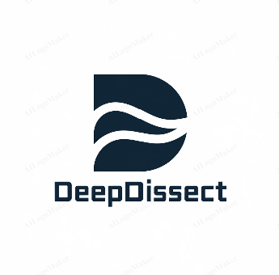

# Deep Dissect

**Version:** 1.0 

## Summary

The anonymized repository was created solely for a submission process.
The maintained and up-to-date version is available in the official repository:  
https://github.com/tmdt-buw/deep-dissect

`deep_dissect` is a Python library tailored for performing ablation studies on MMDetection models. It offers tools to investigate and assess the influence of different components within object detection models, with a particular focus on detection transformer models implemented in the MMDetection framework.

## Features

- **Ablation Study Support:** Easily perform ablations by removing or modifying parts of your detection model.
- **Customizable:** Highly customizable to suit different experimental setups and model variations.

## Installation

Use the official repository rather than the anonymized submission version:
https://github.com/tmdt-buw/deep-dissect

## License
This project is licensed under the MIT License.
